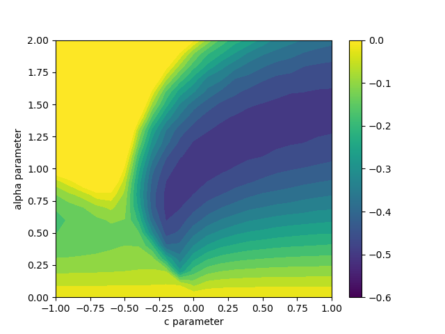

# Quantum Monte Carlo

## 1. Simple QMC for the ground state of hydrogen atom

### 1.1 Theoretical backgrounds:
If we use the following trial function:
$$\psi(r) = (c r+1) e^{-\alpha r}$$

The the ration of the probabilty density at two different sites r1 and r2 becomes:

$$\frac{\rho(r_1)}{\rho(r_2)} = \frac{(c r_1+1)^2 e^{2 \alpha  (r_2-r_1)}}{(c r_2+1)^2}$$

We have the expectation of the energy:
$$\langle \psi|\hat{H}|\psi\rangle = \underset{r \sim \rho(r)}{E} \frac{\hat{H}\psi(r)}{\psi(r)}$$

Given the trial wavefunction, we have the energy expression as follows,

$$\frac{\hat{H}\psi(r)}{\psi(r)} = \frac{-c (r (\alpha  (\alpha  r-4)+2)+2)+\alpha  (2-\alpha  r)-2}{2 r (c r+1)}$$

Notice the random walk should be always in 3d space, so our coordinate r should be:

$$ \mathbf{r} = (x, y, z)$$

### 1.2 Final results:
The finial contour plot with different parameters can be shown in the following figure:

## 2. QMC for ground state of hydrogen molecule

### 2.1 Hydrogen molecule with simple Jastrow factor
Consider the wave function in the following form, where r12 is the distance between two electron.

$$\psi_J(\mathbf{r_1}, \mathbf{r_2}) = e^{-u(r_{12})}$$

$$u(r) = \frac{F}{2(1+r/F)}$$
$$\nabla u(r) = -\frac{\mathbf{r}}{r} \frac{1}{2(1+r/F)^2}$$
$$\nabla^2 u(r) = - \frac{1}{r}\frac{1}{2(1+r/F)^3} $$

Suppose our wave function has the following form,

$$ \Psi(\mathbf{r_1}, \mathbf{r_2}) = \psi_D(\mathbf{r_1}, \mathbf{r_2}) \psi_J(\mathbf{r_1}, \mathbf{r_2}) $$

For functions only involve with the one-electron coordinates (and singlet ground state), we have

$$\psi_D(\mathbf{r_1}, \mathbf{r_2}) = \psi(\mathbf{r_1}) \psi(\mathbf{r_2}) $$

For the variational trial wave function, there is VB form,

$$  \psi(\mathbf{r}) = \phi(\mathbf{r} - \mathbf{R_1}) \phi(\mathbf{r} - \mathbf{R_2}) $$

And MO form, 

$$ \psi(\mathbf{r}) = \phi(\mathbf{r} - \mathbf{R_1}) + \phi(\mathbf{r} - \mathbf{R_2}) $$

Then we need the Hamilitonian for the hydrogen molecule system:
$$\hat{H} = -\frac{1}{2} \nabla^2 - \frac{1}{|\mathbf{r_1} - \mathbf{R_1}|} - \frac{1}{|\mathbf{r_1} - \mathbf{R_2}|} - \frac{1}{|\mathbf{r_2} - \mathbf{R_1}|} - \frac{1}{|\mathbf{r_2} - \mathbf{R_2}|} + \frac{1}{|\mathbf{r_1} - \mathbf{r_2}|} + \frac{1}{|\mathbf{R_1} - \mathbf{R_2}|}$$

$$\hat{H}_{kin} = -\frac{1}{2} \nabla_1^2 -\frac{1}{2} \nabla_2^2 $$
$$\hat{H}_{pot} = -\frac{1}{|\mathbf{r_1} - \mathbf{R_1}|} - \frac{1}{|\mathbf{r_1} - \mathbf{R_2}|} - \frac{1}{|\mathbf{r_2} - \mathbf{R_1}|} - \frac{1}{|\mathbf{r_2} - \mathbf{R_2}|} $$

$$\hat{H}_{ee} = \frac{1}{|\mathbf{r_1} - \mathbf{r_2}|} $$

$$\hat{H}_{pp} = \frac{1}{|\mathbf{R_1} - \mathbf{R_2}|} $$

$$ \frac{\nabla^2 \Psi(\mathbf{r_1}, \mathbf{r_2})}{\Psi(\mathbf{r_1}, \mathbf{r_2})} = \frac{\nabla^2\psi_J(\mathbf{r_1}, \mathbf{r_2})}{\psi_J(\mathbf{r_1}, \mathbf{r_2})} + \frac{\nabla^2\psi_D(\mathbf{r_1}, \mathbf{r_2})}{\psi_D(\mathbf{r_1}, \mathbf{r_2})} $$

$$\left\{-2 (c r+1) (\alpha +c (\alpha  r-1)) e^{\alpha  (-2 r+\text{R1}+\text{R2})},0,0\right\}$$

