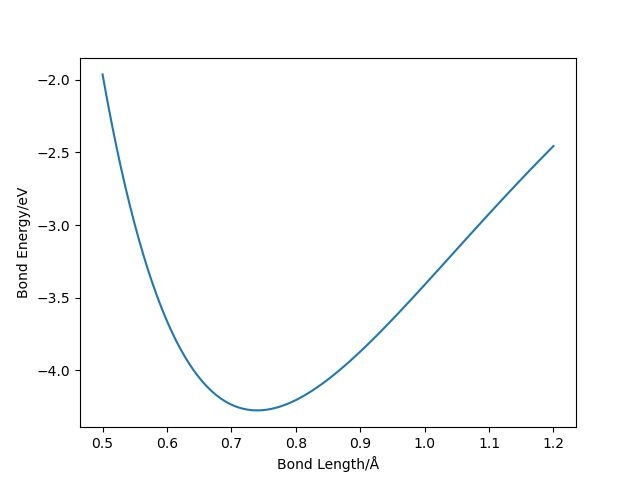

# Quantum Monte Carlo

## 1. Simple QMC for the ground state of hydrogen atom

### 1.1 Theoretical backgrounds:
If we use the following trial function:
$$\psi(r) = (1+cr) e^{-\alpha r}$$

The the ration of the probabilty density at two different sites r1 and r2 becomes:

$$\frac{\rho(r_1)}{\rho(r_2)} = \frac{(c r_1+1)^2 e^{2 \alpha  (r_2-r_1)}}{(c r_2+1)^2}$$

We have the expectation of the energy:
$$\langle \psi|\hat{H}|\psi\rangle = \underset{r \sim \rho(r)}{E} \frac{\hat{H}\psi(r)}{\psi(r)}$$

Given the trial wavefunction, we have the energy expression as follows,

$$\frac{\hat{H}\psi(r)}{\psi(r)} = \frac{-c (r (\alpha  (\alpha  r-4)+2)+2)+\alpha  (2-\alpha  r)-2}{2 r (c r+1)}$$

Notice the random walk should be always in 3d space, so our coordinate r should be:

$$ \mathbf{r} = (x, y, z)$$

### 1.2 Final results:
The finial contour plot with different parameters can be shown in the following figure:

## 2. QMC for ground state of hydrogen molecule

### 2.1 Hydrogen molecule with simple Jastrow factor
Consider the wave function in the following form, where r12 is the distance between two electron.

$$\psi_J(\mathbf{r_1}, \mathbf{r_2}) = e^{-u(r_{12})}$$

$$u(r) = \frac{F}{2(1+r/F)}$$
$$\nabla u(r) = -\frac{\mathbf{r}}{r} \frac{1}{2(1+r/F)^2}$$
$$\nabla^2 u(r) = - \frac{1}{r}\frac{1}{(1+r/F)^3} $$

Suppose our wave function has the following form,

$$ \Psi(\mathbf{r_1}, \mathbf{r_2}) = \psi_D(\mathbf{r_1}, \mathbf{r_2}) \psi_J(\mathbf{r_1}, \mathbf{r_2}) $$

For functions only involve with the one-electron coordinates (and singlet ground state), we have

$$\psi_D(\mathbf{r_1}, \mathbf{r_2}) = \psi(\mathbf{r_1}) \psi(\mathbf{r_2}) $$

For the variational trial wave function, there is VB form,

$$  \psi(\mathbf{r}) = \phi(\mathbf{r} - \mathbf{R_1}) \phi(\mathbf{r} - \mathbf{R_2}) $$

And MO form, 

$$ \psi(\mathbf{r}) = \phi(\mathbf{r} - \mathbf{R_1}) + \phi(\mathbf{r} - \mathbf{R_2}) $$

Then we need the Hamilitonian for the hydrogen molecule system:
$$\hat{H} = -\frac{1}{2} \nabla^2 - \frac{1}{|\mathbf{r_1} - \mathbf{R_1}|} - \frac{1}{|\mathbf{r_1} - \mathbf{R_2}|} - \frac{1}{|\mathbf{r_2} - \mathbf{R_1}|} - \frac{1}{|\mathbf{r_2} - \mathbf{R_2}|} + \frac{1}{|\mathbf{r_1} - \mathbf{r_2}|} + \frac{1}{|\mathbf{R_1} - \mathbf{R_2}|}$$

$$\hat{H}_{kin} = -\frac{1}{2} \nabla_1^2 -\frac{1}{2} \nabla_2^2 $$

$$\hat{H}_{pot} = -\frac{1}{|\mathbf{r_1} - \mathbf{R_1}|} - \frac{1}{|\mathbf{r_1} - \mathbf{R_2}|} - \frac{1}{|\mathbf{r_2} - \mathbf{R_1}|} - \frac{1}{|\mathbf{r_2} - \mathbf{R_2}|} $$

$$\hat{H}_{ee} = \frac{1}{|\mathbf{r_1} - \mathbf{r_2}|} $$

$$\hat{H}_{pp} = \frac{1}{|\mathbf{R_1} - \mathbf{R_2}|} $$

$$ \frac{\nabla^2 \Psi(\mathbf{r_1}, \mathbf{r_2})}{\Psi(\mathbf{r_1}, \mathbf{r_2})} = \sum_{i=1,2} \frac{\nabla_i^2\psi_J(\mathbf{r_1}, \mathbf{r_2})}{\psi_J(\mathbf{r_1}, \mathbf{r_2})} + \frac{\nabla_i^2\psi_D(\mathbf{r_1}, \mathbf{r_2})}{\psi_D(\mathbf{r_1}, \mathbf{r_2})} + 2 \frac{\nabla_i\psi_J(\mathbf{r_1}, \mathbf{r_2})}{\psi_J(\mathbf{r_1}, \mathbf{r_2})} \cdot \frac{\nabla_i\psi_D(\mathbf{r_1}, \mathbf{r_2})}{\psi_D(\mathbf{r_1}, \mathbf{r_2})}  $$

If we have the trial wave function,
$$\phi(r) = (1+cr)e^{-\alpha r}$$

We have the following formula,
$$ \nabla \phi(r) = (c-\alpha  (c r+1))  e^{-\alpha r} \frac{\mathbf{r}}{r}$$

$$ \nabla^2 \phi(r) = \frac{ (c (\alpha  r (\alpha  r-4)+2)+\alpha  (\alpha  r-2))}{r} e^{-\alpha r} $$

While
$$\frac{\nabla_i \psi_D(\mathbf{r_1}, \mathbf{r_2})}{\psi_D(\mathbf{r_1}, \mathbf{r_2})} =  \frac{\nabla_i \psi(\mathbf{r_i})}{\psi(\mathbf{r_i})} $$

and
$$\frac{\nabla_i^2 \psi_D(\mathbf{r_1}, \mathbf{r_2})}{\psi_D(\mathbf{r_1}, \mathbf{r_2})} = \frac{\nabla_i^2 \psi(\mathbf{r_i})}{\psi(\mathbf{r_i}) }  $$

In VB case,

$$ \frac{\nabla_i \psi(\mathbf{r_i})}{\psi(\mathbf{r_i})} = \frac{\nabla_i \phi(\mathbf{r_i-R_1})}{\phi(\mathbf{r_i-R_1})} + \frac{\nabla_i \phi(\mathbf{r_i-R_2})}{\phi(\mathbf{r_i-R_2})} $$

$$ \frac{\nabla_i^2 \psi(\mathbf{r_i})}{\psi(\mathbf{r_i})} = \frac{\nabla_i^2 \phi(\mathbf{r_i-R_1})}{\phi(\mathbf{r_i-R_1})} + \frac{\nabla_i^2 \phi(\mathbf{r_i-R_2})}{\phi(\mathbf{r_i-R_2})} + \frac{\nabla_i \phi(\mathbf{r_i-R_1})}{\phi(\mathbf{r_i-R_1})} \cdot \frac{\nabla_i \phi(\mathbf{r_i-R_2})}{\phi(\mathbf{r_i-R_2})} $$

In MO case,

$$ \frac{\nabla_i \psi(\mathbf{r_i})}{\psi(\mathbf{r_i})} = \frac{\nabla_i \phi(\mathbf{r_i-R_1}) + \nabla_i \phi(\mathbf{r_i-R_2}) }{\phi(\mathbf{r_i-R_1}) + \phi(\mathbf{r_i-R_2})} $$

$$ \frac{\nabla_i^2 \psi(\mathbf{r_i})}{\psi(\mathbf{r_i})} = \frac{\nabla_i^2 \phi(\mathbf{r_i-R_1}) + \nabla_i^2 \phi(\mathbf{r_i-R_2}) }{\phi(\mathbf{r_i-R_1}) + \phi(\mathbf{r_i-R_2})} $$

With these formula, we have got the following energy table (we can use MO and VB freely as we wish, here we use MO as the atomic wave function)

| Bond Length Å | Binding Energy (eV)     |
| :---:         |          :---:          |
| 0.66          |   -4.10                 |
| 0.68          |   -4.19                 |
| 0.70          |   -4.24                 |
| 0.72          |   -4.27                 |
| 0.74          |   -4.28                 |
| 0.76          |   -4.26                 |
| 0.78          |   -4.24                 |
| 0.80          |   -4.20                 |

We can fit the data with Morse potential.

$$ V(r) = D_e(1-e^{-a(r-r_e)})^2 $$

In the hydrogen case, We have the parameter 

$$ D_e = 4.28 eV, a = 2.30 Å^{-1}, r_e = 0.74 Å$$

And the potential energy surface can be shown as follows.

## 3. Ground state for Lithium Atom

### 3.1 Add Slter determinants for Lithium Atom

In the case of Lithium Atoms, thing gos different, since the lithiun atom has three electrions and thus open-shell, Slater determinant should be introduced in order to describe this system.

The total wavefunction could be separates as the product of an arbitrary NxN determinate and a suitable fully symmetric function J, as follows,

$$ \psi(1\sigma_1, 2\sigma_2,....,N\sigma_N) = \left| \phi_i(k) \langle \sigma_k| s_i\rangle \right| J(1\sigma_1, 2\sigma_2,....,N\sigma_N) $$ 

One may ntoice that here we decompose the wave function into two parts, i.e. determinant of single-particle states containing the spin (anti-symmetric), and a Jastrow function depending on the spin (symmetric). In this way, the whole wave function can be anti-symmetric and thus describe a fermion system. Since different spin particles are orthogonal, the determinant can be further decomposed into two orthogonal parts, each with one specified spin. In this way, the spin are excluded from the determinants.

The oribtal of Li atom are s states amd depend only on the distance r from the nucleus. We can represent the Slater function as follows.

$$ \psi_n(r) = A\sum^m_{\nu=1}\phi_{\nu n}r^{p_\nu}exp(-\tilde\zeta_n r)$$

In this formula, we have 3 electrons with 6 states, i.e. the three electrons occupy 1s 2s obitals, each with two spin states. Notice we have a nodal wavefunction, so $$ p_{\nu n} $$ would be non-zero.

In additon to the above atomic wave functions, we also need the Jastrow part of the wave function, as follows.

$$ J(r_1, r_2, ..., r_n) = exp(\sum_{i<j}-u(r_{ij}))$$

Since we are using slater determinant as thw wave function, the derivative of determinant w.r.t coordinates should be listed as follows. We denote the inverse matrix as A, then we have the following formula, if we only change $$ k_{th} $$ electron coordinate i.e. Gibbs sampling, we have the following result.

$$ q = \frac{D^{new}}{D^{old}} = \sum_{j=1}^N A_{kj}\phi_j(r^{new}_k)$$

$$ \frac{\nabla_k D}{D} = \sum_{j=1}^N A_{kj}\nabla_k\phi_j(r^{new}_k) $$

$$ \frac{\Delta_k D}{D} = \sum_{j=1}^N A_{kj}\Delta_k\phi_j(r^{new}_k) $$